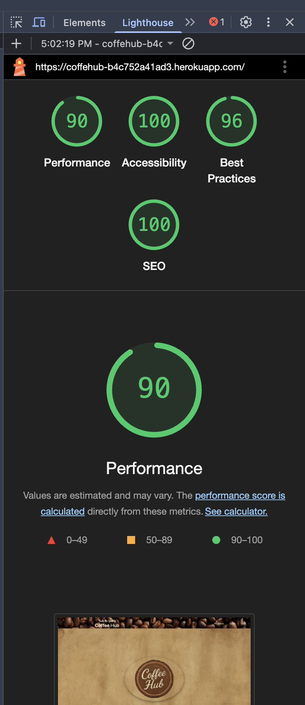

# ☕ CoffeHub - Online Coffee Shop


**Developer: Olle**  
🌐 [Visit Live Website](https://your-live-site-link.com)

---

## 📖 Table of Contents
- [About](#about)
- [User Goals](#user-goals)
- [Site Owner Goals](#site-owner-goals)
- [User Experience](#user-experience)
- [User Stories](#user-stories)
- [Design](#design)
  - [Colours](#colours)
  - [Fonts](#fonts)
  - [Structure](#structure)
  - [Wireframes](#wireframes)
- [Technologies Used](#technologies-used)
- [Features](#features)
- [Testing](#testing)
- [Bugs](#bugs)
- [Deployment](#deployment)
- [Credits](#credits)
- [Acknowledgements](#acknowledgements)

---

## 📝 About

CoffeHub is an eCommerce Django web app for coffee lovers. Users can browse, add to cart, and purchase coffee products. The site supports email verification, secure checkout via Stripe, and includes user authentication features.

---

## 🎯 User Goals
- Browse a wide selection of coffee products
- Add and remove products from a shopping cart
- Register and log in securely
- Make secure payments
- Receive email confirmations and account verification

## 🎯 Site Owner Goals
- Provide a reliable platform to sell coffee products
- Enable easy account creation and verification
- Allow secure Stripe-based payments
- Collect user data for order processing

---

## 🎨 User Experience

### 🎯 Target Audience
- Coffee enthusiasts
- Online shoppers
- Frequent users of specialty coffee products

### 🎯 User Requirements & Expectations
- Easy navigation and responsive design
- Quick access to cart and checkout
- Secure login and signup flow
- Product details with images and prices
- Order confirmation and email verification

---

## ✅ User Stories

### Users

<details><summary>1. As a user, I can register an account with email verification</summary>

</details>

<details><summary>2. As a user, I can browse all available products</summary>

</details>

<details><summary>3. As a user, I can add items to my cart</summary>

</details>

<details><summary>4. As a user, I can view and manage my cart</summary>

</details>

<details><summary>5. As a user, I can check out securely using Stripe</summary>

</details>

<details><summary>6. As a user, I can view a success or cancellation message</summary>

</details>

### Admin

<details><summary>7. As an admin, I can manage product inventory.</summary>

</details>

<details><summary>8. As an admin, I can view orders and users.</summary>

</details>

---

## 🎨 Design

### 🎨 Colours
- Earthy tones (brown, beige) to reflect coffee theme

### 🎨 Fonts
- Main font: Montserrat / Sans-serif (Google Fonts)

### 🎨 Structure
- Home > Products > Cart > Checkout > Success
- Navbar and Footer consistent across pages

## 🛢️ Database

The CoffeHub project uses Django’s ORM to manage a relational database structure. In development, it uses SQLite, while PostgreSQL is used for production.

---

### **🧾 Models Overview**

---

### **User Model**
This project uses Django’s built-in `User` model (`django.contrib.auth.models.User`) for authentication. No custom user model was created.

- `username`: User’s unique identifier.
- `email`: Used for registration and verification.
- `password`: Hashed and securely stored.
- `is_active`, `is_staff`, `date_joined`: Standard Django fields.
- Relationships: Linked via ForeignKey or OneToOneField in other models like `Cart` and `Comment`.

---

### **Product Model**
Located in: `products/models.py`

Represents a product available for purchase.

- `name`: `CharField` – Name of the product.
- `description`: `TextField` – Optional details.
- `price`: `DecimalField` – Cost of the product.
- `image_url`: `URLField` – Image of the product.

---

### **Comment Model**
Located in: `products/models.py`

Allows users to comment on products.

- `product`: `ForeignKey` to `Product`.
- `user`: `ForeignKey` to Django `User`.
- `text`: `TextField` – Content of the comment.
- `created_at`: `DateTimeField` – Timestamp.

---

### **Cart Model**
Located in: `checkout/models.py`

Each user has one associated cart.

- `user`: `OneToOneField` to `User`.
- `total_price()`: method – Calculates total cost of items.

---

### **CartItem Model**
Located in: `checkout/models.py`

Individual product added to a cart.

- `cart`: `ForeignKey` to `Cart`.
- `product`: `ForeignKey` to `Product`.
- `quantity`: `PositiveIntegerField` – Defaults to 1.
- `total_price()`: method – Line total for the product.

---

### **ERD Diagram**
<details><summary>View Diagram</summary>

</details>

> 💡 _All models are registered in the Django admin panel for easy access and management._

### 🎨 Wireframes
Wireframes were created using [Balsamiq](https://balsamiq.com/) to plan the UI structure.

<details><summary>Home</summary>

</details>
<details><summary>Products</summary>


</details>
<details><summary>Cart</summary>

</details>
<details><summary>Account</summary>


</details>
---

## 🚀 Features

### ✅ Authentication
- **User Registration** with email verification using SendGrid.
- **Login/Logout** functionality with feedback messages.
- **Only verified users can check out**, enhancing security and reliability.

<details><summary>🔠Screenshots</summary>

  
  


</details>

---

### 🛒 Cart System
- Users can:
  - Add products to a cart.
  - Increase/decrease quantity or remove items.
  - View cart summary including item count and total price.
  - Cart is session-based for anonymous users and linked to accounts for authenticated users.
- Cart **empties automatically after successful checkout**.

<details><summary>🛒 Screenshots</summary>

  
  

  

</details>

---

### 💳 Stripe Checkout Integration
- Secure payment handling through Stripe.
- Redirects users to success or cancel page depending on payment outcome.
- Order summary and confirmation shown after payment.
- Works with **Stripe test cards** for development.

<details><summary>💳 Screenshots</summary>

  
  


</details>

---

### 🛍️ Product Pages
- **Product List View**:
  - All coffee products displayed with name, image, price, and link to details.
- **Product Detail View**:
  - Includes image, detailed description, price, and "Add to Cart" button.
  - Users can leave comments after logging in.

<details><summary>☕ Screenshots</summary>

  


</details>

---

### 💬 Product Comments
- Authenticated users can:
  - Leave comments on product pages.
  - View all comments related to a product.
  - Delete their own comments.
- Admin can manage all comments through the admin panel.

<details><summary>💬 Screenshots</summary>

  


</details>

---

### 📦 Admin Features
- Admin panel access to:
  - Manage all products (create, update, delete).
  - Review and delete inappropriate comments.
  - Monitor cart items and order-related data (if stored).

<details><summary>🔠Screenshots</summary>

  


</details>

---

### 📱 Responsive UI
- Mobile-friendly design using Bootstrap 5.
- Smooth navigation across desktop, tablet, and mobile devices.
- **Cart, navbar, and footer adapt to screen size.**

<details><summary>📱 Screenshots</summary>

  


</details>

---

### 📧 Email Functionality
- SendGrid integration sends:
  - Account verification emails.
  - (Planned) Order confirmation emails after checkout.

<details><summary>📧 Screenshots</summary>


</details>

---

### ✨ Flash Messages
- Inform users of actions like login, logout, item added to cart, checkout success, etc.
- Shown using Django’s messages framework styled with Bootstrap alerts.

<details><summary>⚡ Screenshots</summary>


</details>

---

## 🧪 Testing
- Manual testing on Chrome, Firefox, Safari, mobile
- Validated HTML, CSS, and Python (PEP8)
- Lighthouse and WAVE accessibility tests

## ✔️ Validation

- HTML and CSS validated using **W3C Validator**.
- Python code checked with **PEP8 compliance**.
- JavaScript validated using **JSHint**.
- Accessibility tested using **Lighthouse** and **WAVE**.

### HTML Validation
The W3C Markup Validation Service was used to validate the HTML of the website. All pages pass with exept signup woch has some error in the allauth code. Ive been trying to fix it in diffrent ways, but did not end upp succesful.
<details><summary>Home</summary>

</details>
<details><summary>Products</summary>


</details>
<details><summary>Cart</summary>

</details>
<details><summary>Account</summary>


### CSS Validation
The W3C Jigsaw CSS Validation Service was used to validate the CSS of the website.
The style.css file was approved.
<details><summary>style.css</summary>

</details>

### JavaScript Validation
JSHint JS Validation Service

<details><summary>Script.js</summary>

</details><hr>

### PEP8 Validation
Python code checked with **PEP8 compliance**


### Accessibility
The WAVE WebAIM web accessibility evaluation tool was used to ensure the website met high accessibility standards. All pages pass with 0 errors.
<details><summary>Home</summary>

</details>
<details><summary>Products</summary>


</details>
<details><summary>Cart</summary>

</details>
<details><summary>Account</summary>


</details>


### Performance 
Google Lighthouse in Google Chrome Developer Tools was used to test the performance of the website. 

<details><summary>Home</summary>

</details>
<details><summary>Products</summary>


</details>
<details><summary>Cart</summary>

</details>
<details><summary>Account</summary>


---


---

## 🐞 Bugs

### Fixed
- Cart not clearing after checkout ➝ Fixed
- Email verification not blocking checkout ➝ Fixed

### Known
- Some iPhone SE responsiveness issues

---

## 🚀 Heroku Deployment


# 🚀 **Heroku Deployment Guide**

## 🌐 **Deploying Through the Heroku Website**
[🔗 **Official Heroku Git Deployment Guide**](https://devcenter.heroku.com/articles/git)  

This guide will walk you through deploying your application from GitHub using **Heroku**.

---

### 📝 **1. Create a Heroku Account & Log In**
1. Visit [**Heroku**](https://heroku.com) and sign up/log in.
2. Once logged in, navigate to your **dashboard**.

<details>
<summary>📸 Screenshots</summary>


</details>

---

### 🚀 **2. Create a Heroku App**
1. Click on **"New"** to create an app.
2. Enter a unique app name (e.g., `doitms3`).
3. Choose a region that suits you.

<details>
<summary>📸 Screenshots</summary>


</details>

---

### 🔧 **3. Configure Settings**
1. Go to **Settings**.
2. Scroll down to **Config Vars** and add:
   - `DATABASE_URL` (from `settings.py`)
   - `SECRET_KEY` (from `settings.py`)
   - `DISABLE_COLLECTSTATIC = 1`

<details>
<summary>📸 Screenshots</summary>


</details>

---

### 💻 **4. Prepare Your Code in VS Code**
1. Install **Gunicorn**:
   ```sh
   pip3 install gunicorn
   pip3 freeze > requirements.txt
   ```
2. Create a **Procfile** in the same directory as `manage.py` with the following content:
   ```
   web: gunicorn doit.wsgi
   ```

<details>
<summary>📸 Screenshot</summary>

</details>

3. Update **settings.py**:
   - Add `'.herokuapp.com'` to `ALLOWED_HOSTS`.
   - Set `DEBUG = False`.

<details>
<summary>📸 Screenshots</summary>


</details>

---

### 🗃️ **5. Run Migrations**
1. Check migration status:
   ```sh
   python3 manage.py showmigrations
   ```
2. Apply migrations:
   ```sh
   python3 manage.py migrate
   ```

---

### 🔗 **6. Connect to GitHub & Deploy**
1. Go to **Deploy** tab in Heroku.
2. Connect your **GitHub** repository.
3. Enable **automatic deploys** from the `main` branch (optional).
4. Click **Deploy**.

<details>
<summary>📸 Screenshots</summary>


</details>

---

### ⚡ **7. Manage Dynos**
1. Check your **dynos**.
2. Make sure you are using the **ECO** plan.

<details>
<summary>📸 Screenshots</summary>


</details>

---

### 🌍 **8. Access Your Application**
1. Click the provided **Heroku link** to access your app.
2. If you encounter issues, check **Heroku build logs** for troubleshooting.

---

## 📟 **Heroku Deployment via Terminal**
If you prefer the **command-line approach**, follow these steps:

### 1️⃣ **Create a New Heroku App**
```sh
heroku create doit-todo-app
```

### 2️⃣ **Set Up Environment Variables**
```sh
heroku config:set SECRET_KEY='your-secret-key'
heroku config:set DATABASE_URL='your-database-url'
```

### 3️⃣ **Push Code to Heroku**
```sh
git push heroku main
```

### 4️⃣ **Run Database Migrations**
```sh
heroku run python manage.py migrate
```

### 5️⃣ **Restart the Heroku App**
```sh
heroku restart
```

---

### 🎉 **Your App is Now Live on Heroku!**  
Click the link provided by **Heroku** to see your deployed application in action. 🚀

---

## 📜 Credits

### 📷 Images
- Placeholder images sourced from **ChatGpt**, edited with GIMP.

### 📌 Code
- Bootstrap templates used for styling.
- Django documentation used for authentication and static file handling.

---

## 💙 Acknowledgements
- Special thanks to **Mo Shami** for guidance.
- Inspired by **Django tutorials and online resources**.
- Thanks to **Code Institute** for support.

##### Back to [top](#table-of-contents)